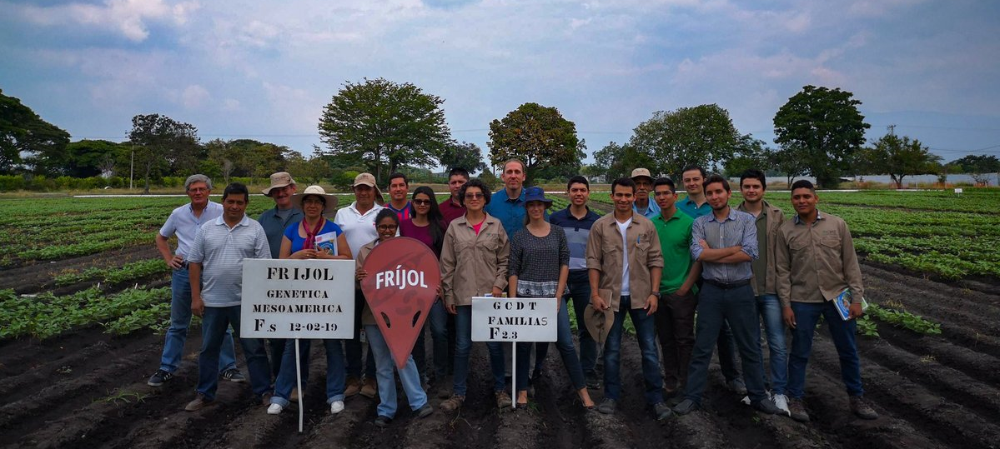

----

{}

---

Within the grain legumes, beans are among the **most important** for human consumption. It is grown in **129 countries** on five continents and it is estimated that some **400 million** people in the tropics consume it. _Latin America_ is the area of greatest production and consumption, it is estimated that more than **45%** comes from this region where it is considered one of the basic products of the peasant economy.

[CIAT's](https://ciat.cgiar.org/) research shows a long and successful trajectory in the development of varieties with genetic resistance to the main pests and diseases that affect the crop. Currently, the Center's scientists emphasize the development of high performance lines with tolerance to drought, heat, adverse soil conditions such as low phosphorus availability and compaction, as well as promising lines for high symbiotic nitrogen fixation, in harmony with the demand for commercial grain. [BlogCIAT](https://blog.ciat.cgiar.org/es/llego-la-hora-de-hablar-de-frijol-en-colombia/#)

 

This webpage was developed with [RStudio](https://www.rstudio.com/products/rstudio/download/)-[Rmarkdown]() and was published into [GitHub](http://github.com)

----

